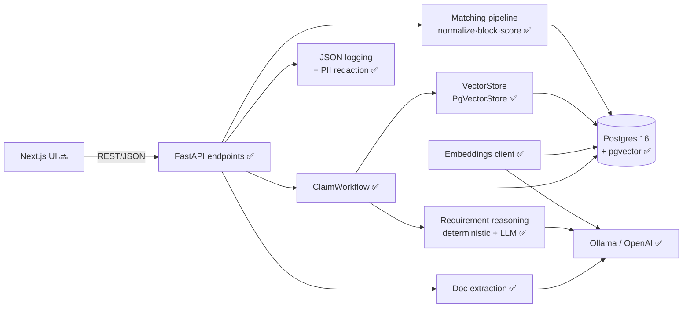

# ClaimPilot — state-aware unclaimed-property claim automation (demo)

> **Demonstration system. Synthetic data. Not legal advice; does not replace official
> state claim processes.** No real PII. State rules are illustrative and do not reflect
> any actual state's program.

ClaimPilot automates one expensive, manual slice of **unclaimed-property recovery**:
matching a claimant to *escheated* property and producing the correct, **state-specific**
document checklist and claim package — grounded in retrieved state rules, with citations,
and with a visible human-review guardrail whenever confidence is low.

## Status

Built in runnable phases (see `docs/adr/0006`), committing after each.

| Phase | Scope | State |
|-------|-------|-------|
| 1 | Scaffold + Postgres/pgvector + domain model + migrations + synthetic seed + rule embeddings | ✅ done |
| 2 | Claimant↔property matching pipeline (normalize → block → score → explain) | ✅ done |
| 3 | State-filtered RAG retrieval + grounded requirement reasoning + citations | ✅ done |
| 4 | Document extraction + requirement satisfaction | ✅ done |
| 5 | Next.js UI incl. the compare-states view | 🔜 planned |
| 6 | Eval harness + observability + this README | ✅ done (backend) |

The **entire backend pipeline is complete and exercisable via the API + CLI.** The web UI
(Phase 5) is the remaining piece.

## Architecture



`✅` built · `🔜` planned. Full diagram set — ER model, claim pipeline sequence, grounding
guardrail, claim-status lifecycle, phased delivery — in [docs/architecture.md](docs/architecture.md).

## Quickstart

```bash
cp .env.example .env            # defaults target a local Ollama gateway
make install                    # uv sync (backend deps)
make dev                        # start Postgres 16 + pgvector (Docker)
make migrate                    # create schema (vector extension, HNSW/GIN indexes)
# Have local models available (or point OPENAI_BASE_URL at OpenAI — see .env.example):
#   ollama pull nomic-embed-text && ollama pull llama3.1
make seed                       # synthetic claimants/properties + embedded state rules
make api                        # http://localhost:8000  (/docs for the OpenAPI UI)
```

Quality gates: `make test` (pytest), `make lint` (ruff), `make typecheck` (mypy),
`make eval` (matching + requirement golden sets).

## 60-second demo (runnable today, via CLI + API)

_A UI click-through lands with Phase 5; until then the pipeline is fully demonstrable from the
terminal._

1. **Reconciliation + explainability** — `make search` runs the matching CLI against the seeded
   index and prints ranked candidates with a confidence score and human-readable
   `match_reasons` (e.g. *"Matched on prior name 'Noah Rhodes' (1.00); Address overlap (1.00);
   SSN last-4 corroborated"*), plus a data-quality summary (missing/duplicate records).
2. **State-specific, cited checklist** — `POST /claims {claimant_id, property_id}` returns the
   required-document checklist, each item carrying a `source_rule_chunk_id`, the drafted claim
   letter, and a trace (tokens + estimated cost). `GET /states/{state}/rules` returns the cited
   source doc.
3. **The money shot — per-state divergence** — create the *same claimant + same amount* against
   two states and watch the checklists diverge (e.g. an amount that clears CA's $1,000
   notarization threshold but not TX's $5,000 → CA requires a notarized form, TX does not).
4. **Document satisfaction** — `POST /claims/{id}/documents` with a synthetic ID extracts fields
   (with per-field confidence), flags any name/address mismatch, and flips the matching
   requirement to satisfied; the claim advances to `ready_to_file` when all required items are met.
5. **Observability** — `GET /debug/last-run` shows the most recent pipeline trace (steps,
   retrieval hits, tokens, cost).

## How per-state divergence works

Each state has a concise, clearly-synthetic rule doc in `seed/state_rules/<state>.md`, and a
single source of truth for the machine-checkable parts in `backend/app/states.py` — chiefly the
**notarization dollar threshold**, which differs per state (CA $1,000 · NY $2,500 · TX $5,000 ·
FL $500 · IL $1,500). Requirement reasoning is deliberately split (ADR 0004):

- **Deterministic logic** decides the hard, numeric rules (notarization threshold, deceased →
  heir docs, business → formation/EIN/signer) and grounds each item on its governing rule chunk.
- **The LLM** proposes nuanced items from the retrieved rules; each must cite a chunk or it is
  flagged `needs_human_review` (ADR 0003). The LLM is fail-soft — the deterministic grounded
  output stands on its own.

Because the thresholds and rule docs genuinely differ, the generated checklists visibly diverge
by state — the basis of the compare-states view.

## Where components are swappable

- **Vector store** — retrieval sits behind a `VectorStore` protocol (`app/services/vector_store.py`);
  `PgVectorStore` is the pgvector implementation. Swap to Milvus/Qdrant by adding one
  implementation; callers are unaffected (ADR 0001).
- **LLM / embeddings provider** — a single OpenAI-compatible client configured by env
  (`OPENAI_BASE_URL`, `LLM_MODEL`, `EMBED_MODEL`, `EMBED_DIM`). Runs against a local Ollama
  gateway *or* hosted OpenAI with no code change (ADR 0002). Note: `EMBED_DIM` is coupled to the
  pgvector column dimension — switching embedding models means re-migrate + re-embed.

## Guardrails (compliance-oriented)

- **Grounding** — no requirement item without a cited rule chunk; ungrounded → `needs_human_review`.
- **Confidence gating** — low extraction confidence or a name/address mismatch never auto-satisfies
  a requirement; it routes to human review.
- **PII** — SSN is masked to last-4 everywhere; a logging filter redacts SSN-like strings; full PII
  is never logged.
- **Disclaimer** — served on the API root and stamped on generated letters.

## Eval harness

`make eval` runs two golden sets and prints precision/recall reports (exit non-zero on regression):

- **Matching** (`evals/match/`) — former-name, outdated-address, nickname, corroboration, and
  negative cases → precision/recall/F1.
- **Requirements** (`evals/requirements/`) — `(state, amount, deceased, business)` → expected
  required-item kinds + threshold flags, including adversarial amounts just over/under each
  notarization threshold → precision/recall + flag accuracy.

Both also run as pytest gates (`make test`).

## What's mocked vs real / what productionizing would add

**Real in this demo:** the record-linkage pipeline (normalization, blocking, multi-signal
scoring, explainability), real vector retrieval over pgvector with state filtering, structured
LLM extraction and requirement reasoning with citation grounding, the human-review guardrail,
per-request tracing with token/cost, and the eval harness.

**Mocked / synthetic:** all data is synthetic (Faker; no real PII); the 5 state rule docs are
illustrative, not real law; document "upload" uses provided synthetic sample text rather than
image/PDF OCR/vision; tests stub the LLM/embeddings for determinism.

**Productionizing would add:** real state-program integrations (filing, status), image/PDF OCR +
vision extraction, KYC / identity verification, e-signature, a job queue for long-running steps,
authn/z + tenancy, real legal rule sourcing with versioning, and observability export.

## Key decisions

See `docs/adr/` (0001 pgvector behind a protocol · 0002 OpenAI-compatible client · 0003 grounded
requirements with citations · 0004 deterministic rules + LLM · 0005 Next.js frontend · 0006
monorepo phased delivery) and the full diagram set in [docs/architecture.md](docs/architecture.md).
