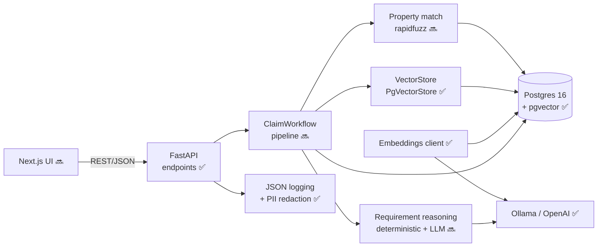

# ClaimPilot — state-aware unclaimed-property claim automation (demo)

> **Demonstration system. Synthetic data. Not legal advice; does not replace official
> state claim processes.** No real PII. State rules are illustrative and do not reflect
> any actual state's program.

ClaimPilot automates one expensive, manual slice of **unclaimed-property recovery**:
matching a claimant to *escheated* property and producing the correct, **state-specific**
document checklist and claim package — grounded in retrieved state rules, with citations.

## Status

Built in runnable phases (see `docs/adr/0006`). **Phase 1 complete:** scaffold, datastore,
domain model, migrations, synthetic seed data, and state-rule embeddings ingestion.

Roadmap: P2 property fuzzy-match · P3 RAG retrieval + grounded requirements · P4 document
extraction · P5 Next.js UI (incl. compare-states) · P6 eval harness + observability + full README.

## Quickstart (Phase 1)

```bash
cp .env.example .env            # defaults target a local Ollama gateway
make install                    # uv sync (backend deps)
make dev                        # start Postgres 16 + pgvector
make migrate                    # create schema (incl. vector extension)
# Have a local embedding model available, e.g.:
#   ollama pull nomic-embed-text
make seed                       # synthetic claimants/properties + embedded state rules
make api                        # http://localhost:8000/healthz
```

## Architecture



`✅` built (Phase 1) · `🔜` planned. Full diagram set — ER model, claim pipeline sequence,
grounding guardrail, claim-status lifecycle, phased delivery — in
[docs/architecture.md](docs/architecture.md).

_60-second demo script, per-state divergence walkthrough, swappability notes, and the
"mocked vs real" section are finalized in Phase 6._

## Key decisions

See `docs/adr/` — pgvector behind a `VectorStore` protocol, OpenAI-compatible client
(local gateway or OpenAI), grounded-requirements-with-citations, deterministic rules + LLM,
Next.js frontend, monorepo phased delivery.
