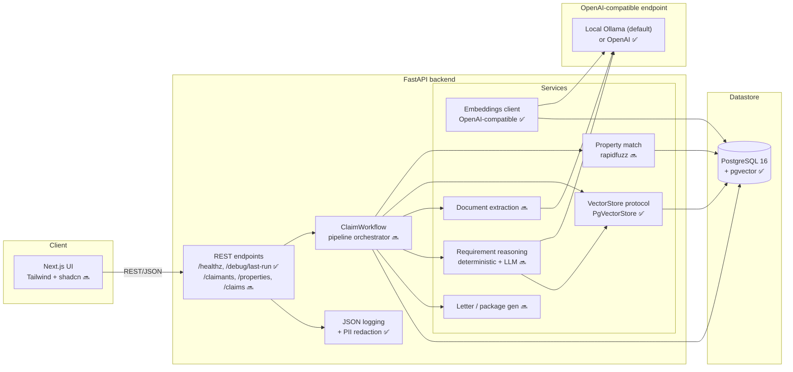
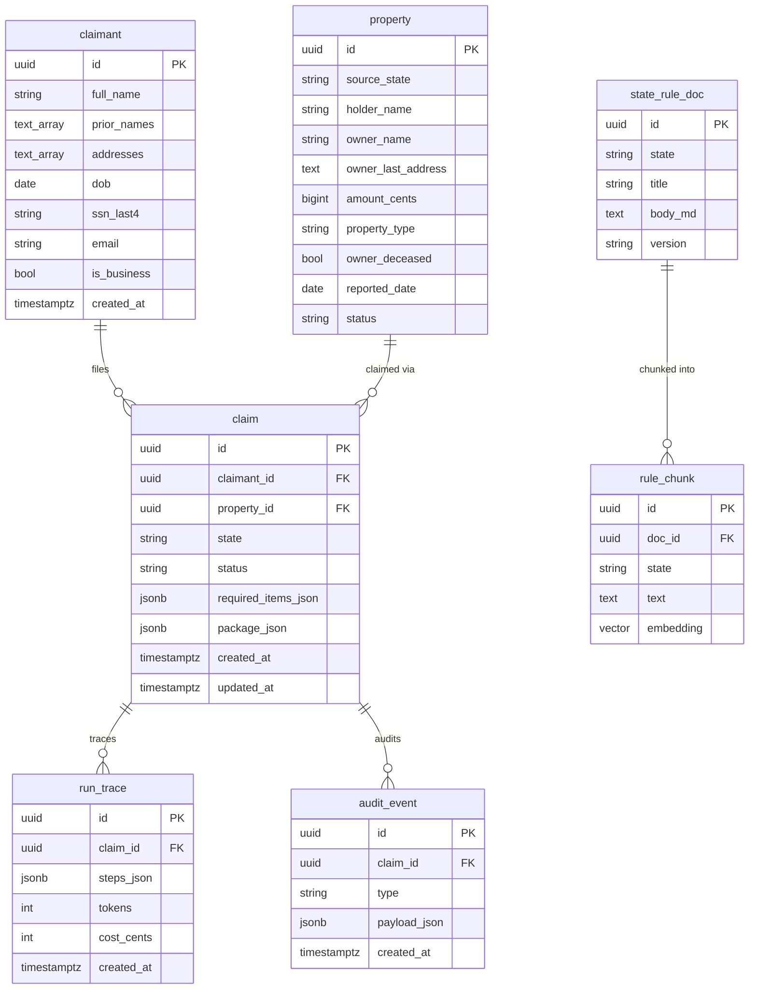
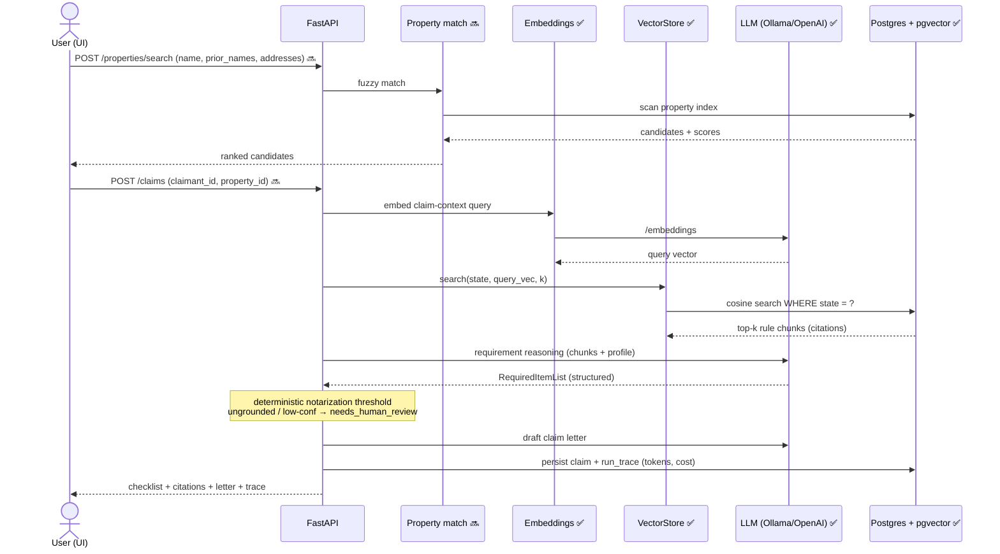
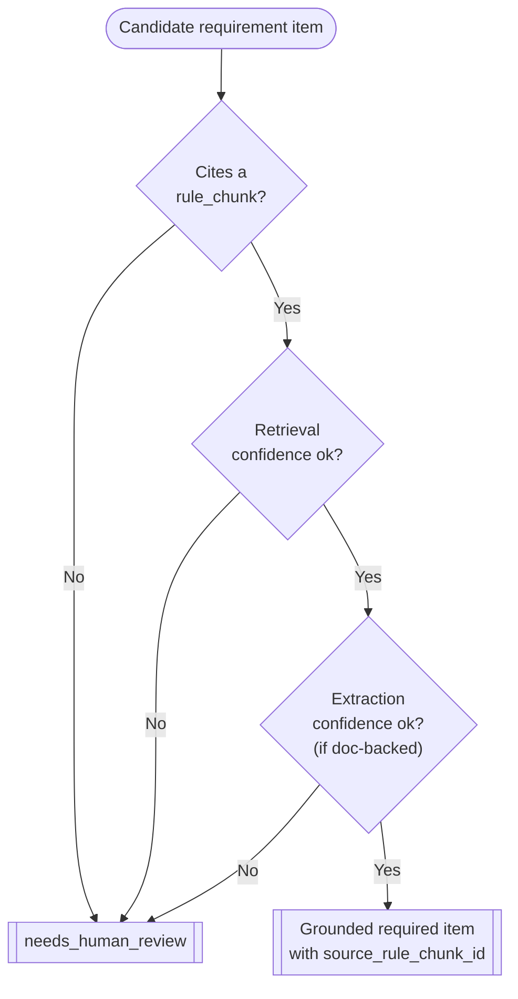
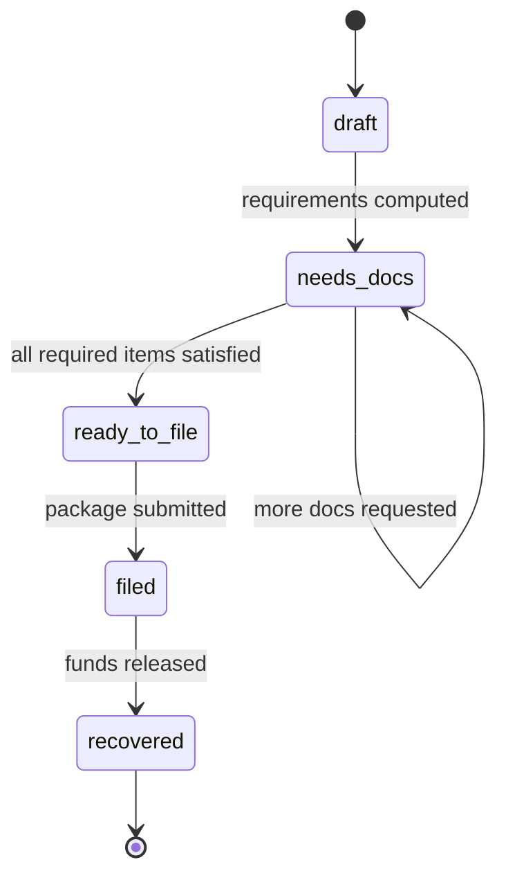
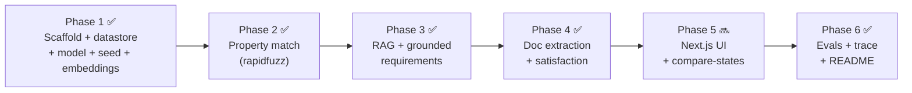

# ClaimPilot — Architecture diagrams

> **Demonstration system. Synthetic data. Not legal advice.**
>
> Legend for build status: ✅ built (Phases 1–4) · 🔜 planned (Phase 5 UI, per `docs/adr/0006`).
> Diagrams document the intended design; nodes touching unbuilt pipeline steps are marked 🔜.

## 1. System architecture

## 2. Domain model (ER)

All seven tables exist as of Phase 1. `rule_chunk.embedding` is `vector(EMBED_DIM)` —
dimension from config (see `docs/adr/0001`).

## 3. Claim pipeline (sequence)

The end-to-end flow a `POST /claims` will drive. Phase 1 ships the datastore, embeddings,
and state-filtered retrieval; the orchestrated steps land in Phases 2–5.

## 4. Grounding guardrail (decision flow)

Every requirement item must cite a retrieved rule chunk; otherwise it is routed to human
review (see `docs/adr/0003`). Enforced in Phase 3.

## 5. Claim status lifecycle

The `claim.status` values enforced by a DB check constraint (built in Phase 1).

## 6. Phased delivery

Runnable phases, one Linear issue each (BRA-920…925). See `docs/adr/0006`.

